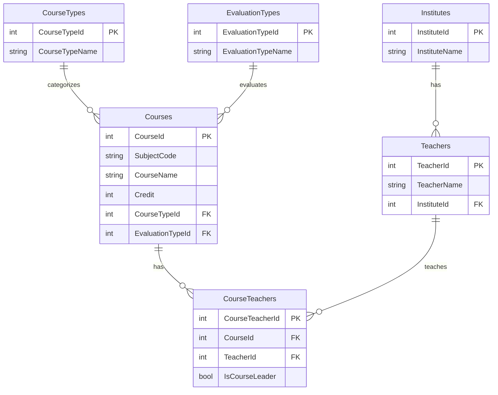

# Self Evaluation Sheet

**Name:** Syed Hasan Shahid  
**Neptun:** ANJG0Z
**Claimed points in total:** **41 points**  
**Obtainable points:** **30 / 30**

**Project name:** ProfCourse  
**Database:** `se_project_hasan`  
## Short project description

ProfCourse is a Windows Forms application for managing the Data Science in Business programme at Corvinus University.
It uses a custom Azure SQL database with courses, teachers, institutes, course types, evaluation types, and course-teacher assignments.

The main many-to-many relationship is:

`Courses` ↔ `CourseTeachers` ↔ `Teachers`

The master-detail relationship is:

`Institutes` → `Teachers`

---

## Database

### Used tables

- `Courses`
- `Teachers`
- `Institutes`
- `CourseTypes`
- `EvaluationTypes`
- `CourseTeachers`

**Claimed:** `6x1p` One point per table used in the app = **6p**

Proof:
- `Courses` is used in the Courses screen.
- `Teachers` is used in the Teachers screen.
- `Institutes` is used in the Teachers screen and Institute Teachers screen.
- `CourseTypes` is used in the Courses screen / Add Course dropdown.
- `EvaluationTypes` is used in the Courses screen / Add Course dropdown.
- `CourseTeachers` is used in the Course Teachers screen.

### Mermaid ER diagram

**Claimed:** `1x1p` Mermaid ER diagram = **1p**

---

## Windows Forms Application: User Interface

### Exit confirmation

**Claimed:** `1x1p` The application only exits after confirmation dialog = **1p**

Screenshot: `screenshots/07_exit_confirmation.png`

### UserControls loaded into a Panel

**Claimed:** `3x1p` Buttons load UserControls into a Panel = **3p**

Used UserControls:

- `CoursesUserControl`
- `TeachersUserControl`
- `CourseTeachersUserControl`
- `InstituteTeachersUserControl`

Screenshots:

- `screenshots/01_main_form.png`
- `screenshots/02_courses_grid_filter_bound_controls.png`
- `screenshots/03_teachers_grid_filter.png`
- `screenshots/04_course_teachers_many_to_many.png`
- `screenshots/06_institute_teachers_master_detail.png`

### Dock / Anchor

**Claimed:** `1x1p` Proper Dock / Anchor usage = **1p**

The left navigation panel stays fixed, and UserControls load into the main panel area.

Screenshot: `screenshots/01_main_form.png`

---

## Displaying Table Data

### Courses screen

**Claimed:**

- `1x1p` Data displayed in DataGridView = **1p**
- `1x1p` Foreign key shown via DataGridViewComboBoxColumn = **1p**
- `1x2p` Data source is a custom class = **2p**

Proof:
- Courses are displayed in a DataGridView.
- Course type and evaluation type are shown as dropdown/foreign-key columns.
- The DataGridView uses the scaffolded `Course` class through `courseBindingSource`.

Screenshot: `screenshots/02_courses_grid_filter_bound_controls.png`

### Teachers screen

**Claimed:**

- `1x1p` Data displayed in DataGridView = **1p**
- `1x1p` Data can be filtered with TextBox = **1p**
- `1x1p` Foreign key shown via DataGridViewComboBoxColumn = **1p**
- `1x2p` Data source is a custom class = **2p**

Proof:
- Teachers are displayed in a DataGridView.
- Teacher filtering is available.
- The institute foreign key is displayed as a readable institute value.
- The DataGridView uses the scaffolded `Teacher` class through `teacherBindingSource`.

Screenshot: `screenshots/03_teachers_grid_filter.png`

---

## Data Binding via BindingSource

### Courses screen

**Claimed:**

- `1x2p` Working BindingSource = **2p**
- `4x1p` Other bound controls are used = **4p**

Proof:
- `courseBindingSource` is used.
- Bound controls show selected course details, including CourseName and Credit.

Screenshot: `screenshots/02_courses_grid_filter_bound_controls.png`

---

## Adding New Records via Popup Form

### Add Course form

**Claimed:**

- `1x2p` Working OK and Cancel buttons = **2p**
- `1x1p` Form includes dropdown/list for foreign key selection = **1p**

Proof:
- Add Course popup validates required fields and numeric credit.
- OK and Cancel buttons are configured.
- CourseType and EvaluationType are selected through dropdowns.

Screenshot: `screenshots/08_add_course_popup_full.png`

### Add Teacher form

**Claimed:**

- `1x2p` Working OK and Cancel buttons = **2p**
- `1x1p` Form includes dropdown/list for foreign key selection = **1p**
- `2x1p` Input errors shown via ErrorProvider = **1p**
- `1x1p` OK button disabled on invalid input = **1p**

Proof:
- Add Teacher popup validates TeacherName.
- Institute is selected through a dropdown.
- ErrorProvider is used.
- OK button is disabled when TeacherName is invalid.

Screenshot: `screenshots/09_add_teacher_errorprovider.png`

---

## Intermediate Table of Many-to-Many Relation

**Claimed:** `1x3p` Inserting a record into connector table = **3p**

Proof:
- The Course Teachers screen lets the user select a Course and a Teacher.
- The Add Teacher To Course button inserts a new record into `CourseTeachers`.

Screenshot: `screenshots/04_course_teachers_many_to_many.png`

---

## Master-Detail Relationship

**Claimed:** `1x3p` Inserting a record into a detail table in a master-detail relationship = **3p**

Proof:
- The Institute Teachers screen displays institutes in a ListBox.
- The teachers grid shows teachers belonging to the selected institute.
- A new teacher can be added to the selected institute.

Screenshot: `screenshots/06_institute_teachers_master_detail.png`

---

## Deleting Records

**Claimed:**

- `1x1p` Successful deletion of a selected record = **1p**
- `1x1p` Deletion with confirmation = **1p**

Proof:
- A selected teacher can be deleted.
- A confirmation dialog appears before deletion.

Screenshot: `screenshots/10_delete_teacher_confirmation.png`

---
## Screenshot files included

- `screenshots/01_main_form.png`
- `screenshots/02_courses_grid_filter_bound_controls.png`
- `screenshots/03_teachers_grid_filter.png`
- `screenshots/04_course_teachers_many_to_many.png`
- `screenshots/05_course_teachers_many_to_many_after.png`
- `screenshots/06_institute_teachers_master_detail.png`
- `screenshots/07_exit_confirmation.png`
- `screenshots/08_add_course.png`
- `screenshots/09_add_teacher_errorprovider.png`
- `screenshots/10_delete_teacher_confirmation.png`

Note: Extra points are claimed as a safety margin in order to earn the max score possible. I have only claimed points for features that were working in the uploaded moodle file.

